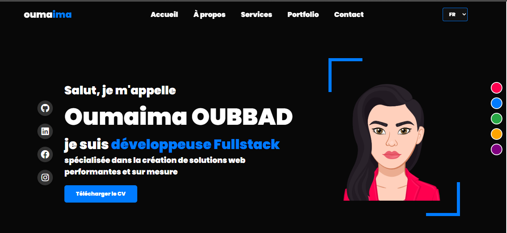
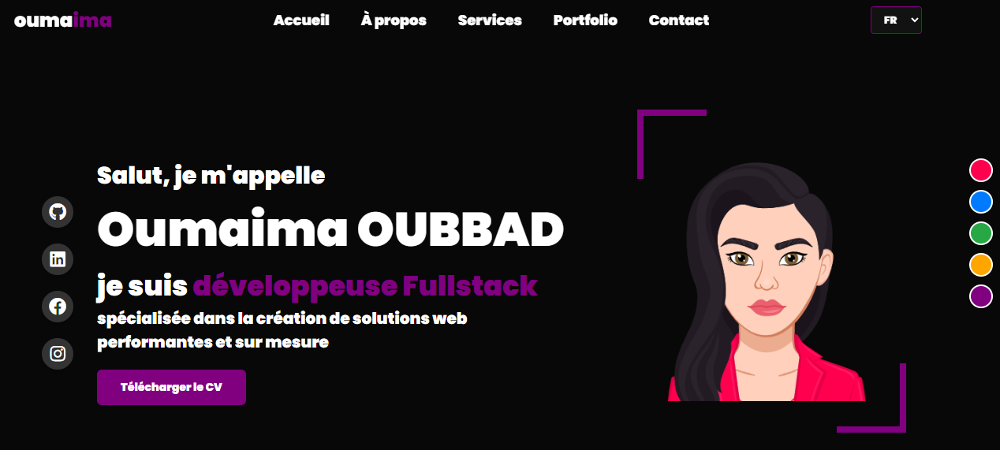
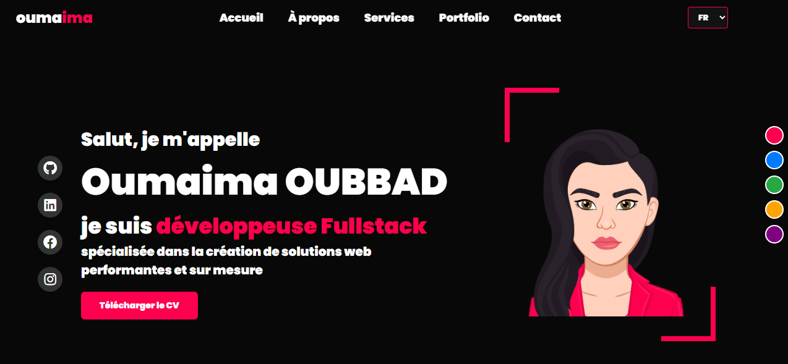
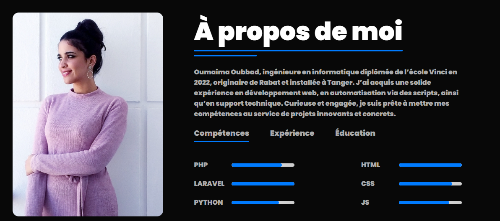
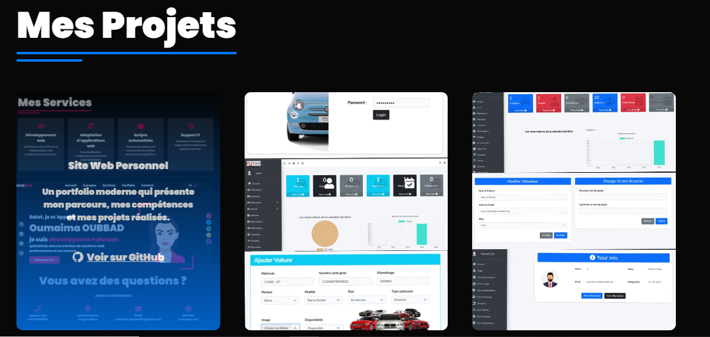
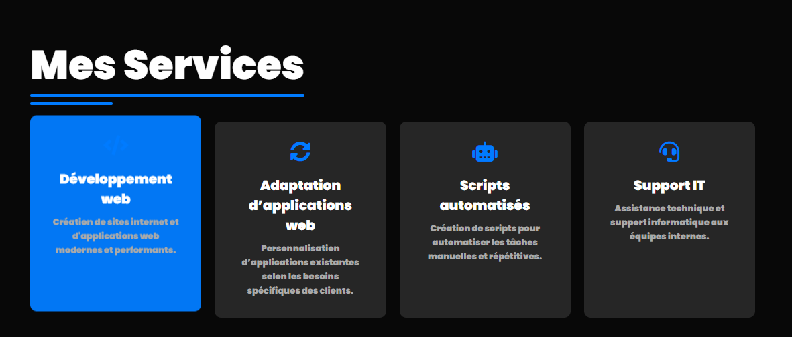
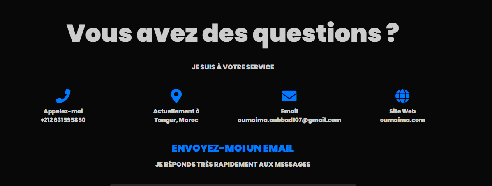
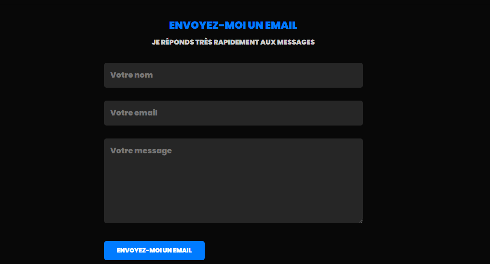

# 🌐 Portfolio Personnel - Oumaima Oubbad

Bienvenue sur mon portfolio ! Ce site web est une vitrine interactive qui regroupe toutes les informations importantes me concernant en tant que développeuse web 💻.

## 🧾 Description

Ce portfolio moderne et responsive a été conçu pour :

- Présenter mon **parcours professionnel**
- Mettre en avant mes **compétences techniques**
- Offrir un accès direct à mon **CV**
- Exposer mes **services** et **projets**
- Permettre une prise de **contact rapide**
- Permettre de **changer la langue** du site : 🇫🇷 🇬🇧 🇸🇦  
- Permettre de **changer le thème** du site avec 5 couleurs 🎨 :  
  🌸 *Rose* | 💙 *Bleu* | 💚 *Vert* | 🖤 *Motard* | 💜 *Mauve*
   
  
## ✨ Fonctionnalités

- 🔄 Changement de langue dynamique (Français / Anglais / Arabe)
- 🎨 Thèmes personnalisables au choix
- 📄 Téléchargement de mon CV
- 📱 Liens directs vers mes comptes réseaux sociaux (LinkedIn, GitHub, etc.)
- 📧 Formulaire de contact fonctionnel avec envoi automatique vers **Google Sheets**
- ⚙️ Interface claire et adaptée à tous les appareils (responsive design)

## 💼 Sections du Site

- **À propos de moi** 🧕
- **Compétences techniques** ⚙️
- **Parcours académique et professionnel** 🎓
- **Services proposés** 💡
- **Projets réalisés** 🛠️
- **CV téléchargeable** 📥
- **Formulaire de contact** 📬
- **Liens vers les réseaux sociaux** 🌍

## 🛠️ Technologies utilisées

- HTML5 
-  CSS3  
- JavaScript 

## 📷 Captures d’écran
- Interface principale avec thème rose
- 
- Page À propos de moi
- 
- Page de projets
- 
- - Page de services
- 
- Section CV avec bouton de téléchargement
- 

## 📩 Contact

🛠️ *Projet personnel en constante évolution. Dernière mise à jour : Juillet 2025*

